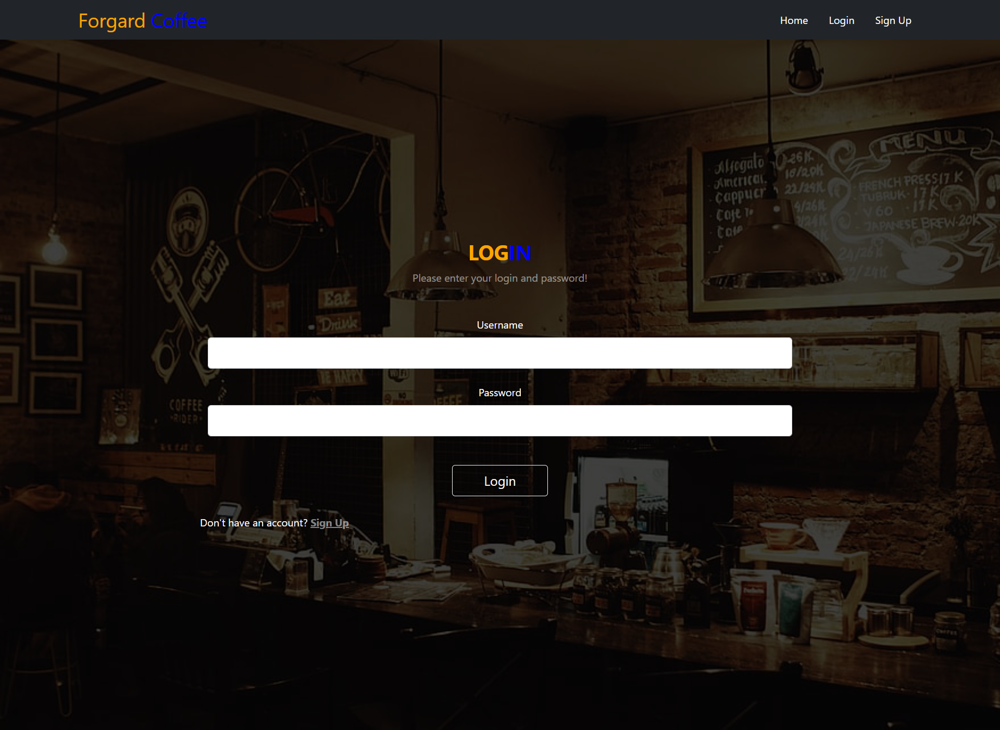
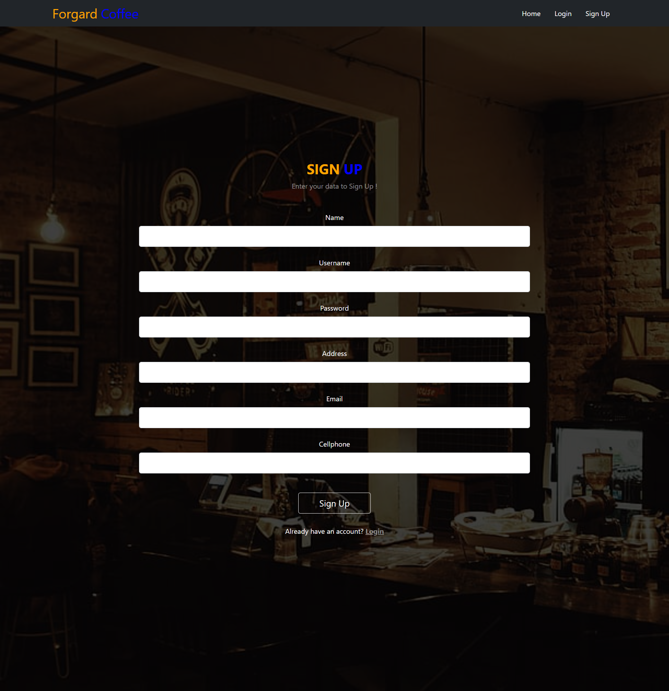
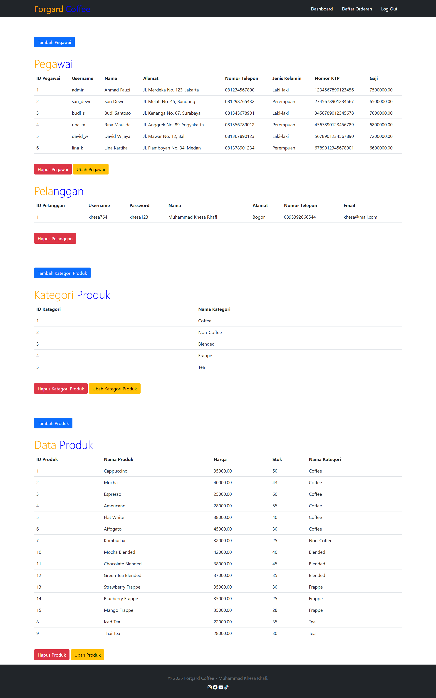
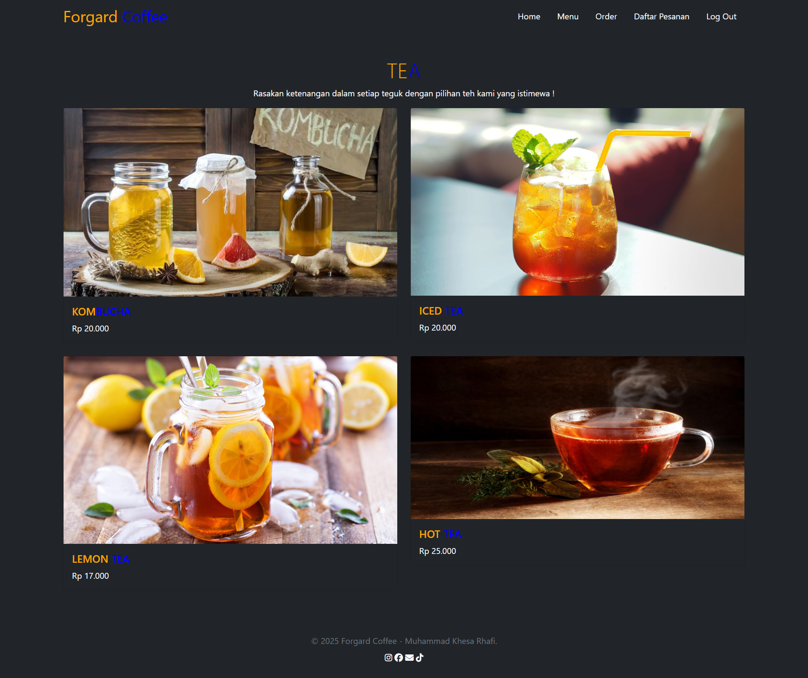
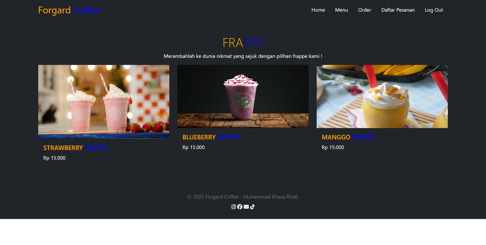
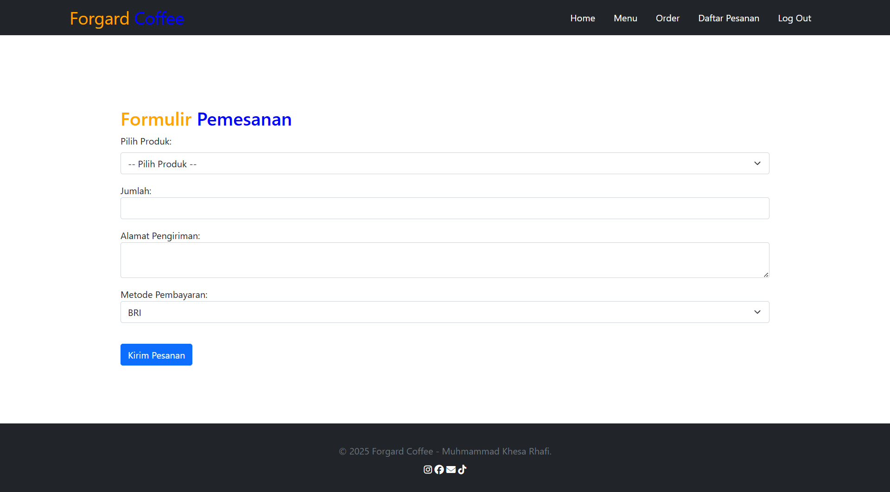
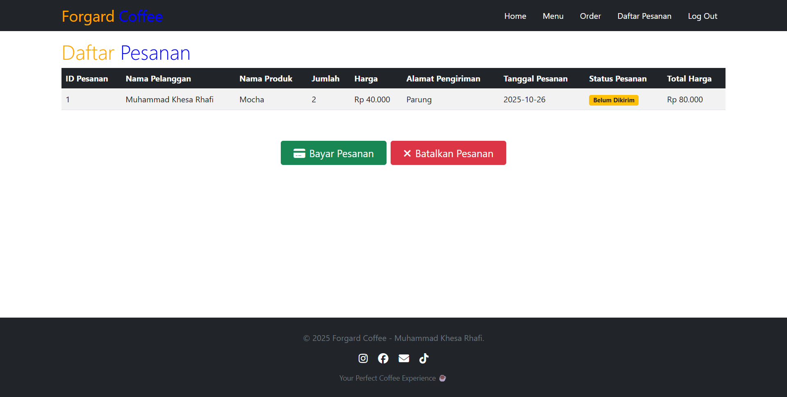

# ☕ Forgard Coffee - Coffee Shop Management System


Aplikasi web manajemen coffee shop berbasis PHP, MySQL, dan Bootstrap 5 untuk mengelola pegawai, produk, pesanan, dan transaksi.


## 🌟 Fitur Utama

### 👨‍💼 Admin
- Manajemen Pegawai (CRUD)
- Manajemen Pelanggan
- Manajemen Kategori & Produk
- Kelola Pesanan & Status Pengiriman
- Proses Pembayaran

### 👥 Pelanggan
- Browse Produk per Kategori
- Order Produk dengan Custom Jumlah
- Riwayat Pesanan & Tracking Status

## 🛠 Tech Stack

**Backend:** PHP 8.2 | **Database:** MySQL/MariaDB | **Frontend:** Bootstrap 5, jQuery, SweetAlert2, AOS

## 🚀 Instalasi

### 1. Clone Repository
Clone atau download repository ini ke folder htdocs XAMPP Anda.

### 2. Setup Database
- Buka phpMyAdmin di http://localhost/phpmyadmin
- Buat database baru dengan nama `coffee_shop`
- Import file SQL yang ada di folder `Coffee Shop Management/database/coffee_shop.sql`

### 3. Jalankan Aplikasi
- Start Apache dan MySQL di XAMPP Control Panel
- Buka browser dan akses: http://localhost/coffee_shop/Coffee%20Shop%20Management/home/index.html

## 👤 Login Credentials

| Role | Username | Password |
|------|----------|----------|
| **Admin** | admin | admin123 |
| **Customer** | khesa764 | khesa123 |

## 📸 Screenshots

### Authentication
<table>
  <tr>
    <td width="50%">
      
      <p align="center"><b>Login Page</b></p>
    </td>
    <td width="50%">
      
      <p align="center"><b>Sign Up Page</b></p>
    </td>
  </tr>
</table>

### Dashboards
<table>
  <tr>
    <td width="50%">
      
      <p align="center"><b>Admin Dashboard</b></p>
    </td>
    <td width="50%">
      
      <p align="center"><b>Customer Dashboard</b></p>
    </td>
  </tr>
</table>

### Product Categories
<table>
  <tr>
    <td width="50%">
      
      <p align="center"><b>Coffee</b></p>
    </td>
    <td width="50%">
      
      <p align="center"><b>Non-Coffee</b></p>
    </td>
  </tr>
  <tr>
    <td width="50%">
      
      <p align="center"><b>Blended</b></p>
    </td>
    <td width="50%">
      
      <p align="center"><b>Frappe</b></p>
    </td>
  </tr>
</table>

### Order Management
<table>
  <tr>
    <td width="50%">
      
      <p align="center"><b>Order Product</b></p>
    </td>
    <td width="50%">
      
      <p align="center"><b>Order History</b></p>
    </td>
  </tr>
</table>

## 💾 Database Schema

Aplikasi ini menggunakan 7 tabel utama dalam database MySQL:

- **pegawai** - Menyimpan data pegawai/admin dengan informasi username, password, nama, alamat, nomor telepon, dan jenis kelamin
- **informasi_pegawai** - Detail tambahan pegawai seperti nomor KTP dan gaji
- **pelanggan** - Data pelanggan yang terdaftar dengan informasi kontak dan email
- **kategori_produk** - Kategori produk (Coffee, Non-Coffee, Blended, Frappe, Tea)
- **produk** - Daftar produk dengan nama, harga, stok, dan kategori
- **pesanan** - Pesanan pelanggan dengan detail jumlah, alamat pengiriman, tanggal, dan status
- **transaksi** - Riwayat transaksi pembayaran dengan metode pembayaran dan total harga

## 📁 Struktur Folder

```
Coffee Shop Management/
├── home/                    # Landing page
├── img/                     # Assets & logo
├── img_web/                 # Screenshots dokumentasi
├── database/                # File SQL & script setup
├── process_admin/           # File processor untuk admin (CRUD)
├── categories[1-4].php     # Halaman kategori produk
├── dashboard_admin.php     # Dashboard admin
├── dashboard_pelanggan.php # Dashboard pelanggan
├── daftar_orderan.php      # Daftar orderan (admin)
├── daftar_pesanan.php      # Daftar pesanan (customer)
├── login.php               # Halaman login
├── signup.php              # Halaman registrasi
├── order.php               # Halaman order produk
└── proses_*.php            # File-file processor
```

## 🔧 Cara Penggunaan

### Untuk Admin:
1. Login menggunakan username `admin` dan password `admin123`
2. Di Dashboard Admin, kelola data pegawai, pelanggan, kategori produk, dan produk
3. Klik menu "Daftar Orderan" untuk melihat dan memproses pesanan pelanggan
4. Update status pesanan dan proses pembayaran

### Untuk Pelanggan:
1. Daftar akun baru melalui halaman Sign Up
2. Login dengan akun yang telah dibuat
3. Browse produk berdasarkan kategori di Dashboard
4. Pilih produk, tentukan jumlah, dan input alamat pengiriman
5. Lihat status pesanan di menu "Daftar Pesanan"

## 🎨 Teknologi & Library

- **PHP Native** - Logika backend tanpa framework
- **MySQL/MariaDB** - Database management
- **Bootstrap 5** - Responsive UI framework
- **jQuery** - AJAX requests tanpa reload halaman
- **SweetAlert2** - Notifikasi & alert yang menarik
- **AOS** - Animasi saat scroll

## 🐛 Troubleshooting

**Database Connection Error:**  
Pastikan database `coffee_shop` sudah dibuat dan diimport dengan benar. Cek juga MySQL di XAMPP sudah running.

**Apache Won't Start:**  
Port 80 mungkin digunakan aplikasi lain. Ubah port Apache di konfigurasi XAMPP atau stop aplikasi yang menggunakan port tersebut.

**Halaman Blank:**  
Enable error reporting di file php.ini untuk melihat error yang terjadi.

## 🔜 Pengembangan Selanjutnya

- Implementasi password hashing untuk keamanan lebih baik
- Prepared statements untuk mencegah SQL injection
- Sistem review dan rating produk
- Dashboard analytics dengan grafik penjualan
- Export laporan ke PDF
- Integrasi payment gateway

## 👨‍💻 Author

**Muhammad Khesa Rhafi**  
📧 muhammadkhesarhafi@gmail.com | 🐙 GitHub: [@Khesa764](https://github.com/Khesa764/forgard-coffee)

## 📝 License

Project ini menggunakan MIT License - bebas digunakan dan dimodifikasi.

---

<div align="center">Made with ☕ and ❤️ by Muhammad Khesa Rhafi</div>
